# ArenaOS AI Landing Page Architecture Manual - Sprint 1.3

This manual documents the architectural composition, layout ordering, design systems alignment, and future extension plan for the public marketing website of the **ArenaOS AI** platform.

---

## 1. Page Structure & Flow

The landing page renders as a unified vertical scroll canvas nested under core layouts.

1.  **Top Anchored Headers**:
    - `AnnouncementBanner`: Static announcement alerts.
    - `NavbarContainer`: Scroll-aware mobile-responsive navigations.
2.  ** स्पॉटलाइट Viewports**:
    - `HeroSection`: Focal platform description and simulated OS dashboard.
    - `TrustedTechSection`: Unified ecosystem grid.
3.  **Operation Blueprint Sections**:
    - `ProblemSection`: Legacy stadium challenges split list.
    - `SolutionSection`: AI Orchestrator flow.
    - `AgentPreviewSection`: 8 specialized agents preview card deck.
    - `FeaturesSection`: Core platform features list.
    - `ArchitectureSection`: Three-tier layer block diagram.
    - `BenefitsSection`: Stakeholder benefit cards.
    - `TechStackSection`: Frontend/Backend/AI categorizations.
4.  **Action Targets & Footers**:
    - `CtaSection`: Main call-to-action signup module.
    - `FooterContainer`: Sitemap listings and copyright registries.

---

## 2. Component & Layout Relationships

Sections are kept as pure Server Components (RSCs) by default. Interactive states are isolated at leaf level.

```mermaid
graph TD
  RootPage[app/page.tsx - RSC] --> AnnouncementBanner[AnnouncementBanner - RSC]
  RootPage --> NavbarContainer[NavbarContainer - Client Component]
  RootPage --> HeroSection[HeroSection - RSC]
  RootPage --> TrustedTechSection[TrustedTechSection - RSC]
  RootPage --> ProblemSection[ProblemSection - RSC]
  RootPage --> SolutionSection[SolutionSection - RSC]
  RootPage --> AgentPreviewSection[AgentPreviewSection - RSC]
  RootPage --> FeaturesSection[FeaturesSection - RSC]
  RootPage --> ArchitectureSection[ArchitectureSection - RSC]
  RootPage --> BenefitsSection[BenefitsSection - RSC]
  RootPage --> TechStackSection[TechStackSection - RSC]
  RootPage --> CtaSection[CtaSection - RSC]
  RootPage --> FooterContainer[FooterContainer - RSC]
```

---

## 3. Data Flow Strategy

Components are completely data-driven. All render text, URLs, categories, and metrics are isolated inside `SectionName.data.ts` files:

- **No inline lists**: Stagger grids map dynamic arrays.
- **Central configuration linkage**: The system version indicator imports variables from the global constants module.

---

## 4. Animation Philosophy

- No direct import of `framer-motion` inside landing page sections.
- **Preset Mapping**:
  - Text headings & Descriptions: `MotionWrapper variant="fade"`
  - Grid Cards & Badges: `MotionWrapper variant="scale"`
  - Layout Blocks & Buttons: `MotionWrapper variant="slide-up"`
- **Reduced Motion**: All animations automatically query `prefers-reduced-motion` settings and turn off transitions globally to respect accessibility parameters.

---

## 5. SEO & Accessibility Strategy

- **SEO**:
  - Includes strict OpenGraph titles, description indices, and Twitter card layout properties.
  - One `<h1>` heading mapped inside the Hero section.
  - Canonical URL alternatives pointing to root paths.
- **Accessibility**:
  - Skip-link triggers allow keyboard navigators to bypass banners.
  - Aria-hidden elements prevent assistive readers from processing background graphics.
  - Color contrasts adhere to WCAG 2.1 AA parameters.

---

## 6. Future Expansion Plan

- **Sprint 1.4+ Integration**: When ready, navigation CTA buttons will link directly to active dashboard sessions.
- **Real Telemetry Bindings**: Telemetry values inside the Hero simulator can be bound to WebSockets or server polling loops.
